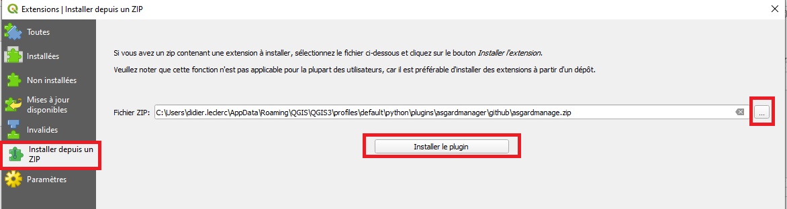
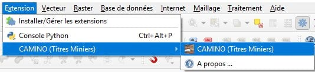
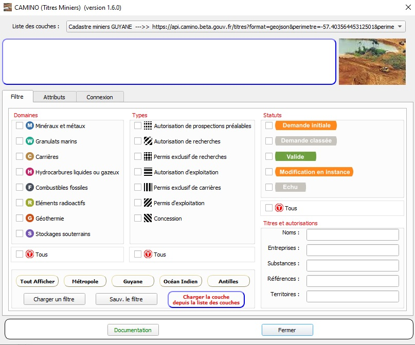

# Camino-flux-QGIS

> Plugin pour QGIS d'import des flux GeoJSON de [Camino](https://camino.beta.gouv.fr), le cadastre minier numérique ouvert

l'API de Camino expose des informations sur les titres miniers et autorisations sous forme de flux GeoJSON ([documentation](https://docs.camino.beta.gouv.fr/pages/Utilisation/04-flux.html)). 

Ce plugin simplifie l'import de ces flux GeoJSON dans QGIS.

---           
## version
- [1.6.0]

---   

## Installation

### Via un dépôt

1. Configurer un dépôt d'extensions

Dans le menu _Extension_, sélectionner _Installer / Gérer les extensions_, puis l'onglet _Paramètres_, ajouter l'url suivante 

- dépôt du ministère : `http://piece-jointe-carto.developpement-durable.gouv.fr/NAT002/QGIS/plugins/plugins.xml`
- dépôt officiel QGIS : `https://plugins.qgis.org/plugins/plugins.xml`

2. Installer et mettre à jour l'extension

Dans le menu _Extension_, sélectionner _Installer / Gérer les extensions, puis l'onglet _Tout_ et enfin _Rechercher_ `camino`.

#### Automatiquement
L’application se trouve sur la ressource du département MSP/DS/GSG (http://piece-jointe-carto.developpement-durable.gouv.fr/NAT002/QGIS/plugins/plugins.xml)
et est donc accessible via le menu Extension : Installer / Gérer les extensions.
Asgard Manager pourra être installé, mis à jour via ce dispositif.

### Manuellement
Procédez via le menu Extension : Installer / Gérer les extensions / item 'Installer depuis un zip'


---

---

## Utilisation

Le plugin est accessible via : 

- le menu _Extension / CAMINO (Titres MIniers) / CAMINO (Titres MIniers)_



- la barre d'outils 


### Interface



- Cliquez sur _Charger la couche depuis la liste des couches_ pour importer les flux geojson et les charger dans une couche Vecteur QGIS
ou
- Cliquez sur l'un des cinq boutons prédéfinis par zone territoriales

#### Paramêtres

Les résultats peuvent être filtrés par : 

- types
- domaines
- statuts
- noms ou siret d'entreprise
- substances
- etc.

#### Authentification 

Les utilisateurs qui possèdent un compte sur Camino, peuvent se connnecter depuis le plugin et ainsi ainsi disposer d'accès restreint à certaines informations. 

Cliquer sur l'onglet _Connexion_.

---

## Documentation

Une documentation complète au format pdf est disponible [ici](https://github.com/MTES-MCT/camino-flux-QGIS/blob/master/doc/camino_doc.pdf)

---

## Crédits

### Production

- [La Fabrique Numérique, Ministère de la transition écologique et solidaire](https://www.ecologique-solidaire.gouv.fr/inauguration-fabrique-numerique-lincubateur-des-ministeres-charges-lecologie-et-des-territoires)

### Équipe

- Didier LECLERC, CMSIG Copnception et développement MTE/MCTRCT SG/SNUM/UNI/DRC
- Nicolas PETITOT, Développeur Camino, Appui métier pour Qgis

---

## Licence

Camino API, le cadastre minier numérique ouvert

[AGPL 3 ou plus récent](https://spdx.org/licenses/AGPL-3.0-or-later.html)

---           

## Technologies
- [Python 3.x]

---           

## Environnement
 - Version de QGIS 3.18 ( fonctionne en 3.x )
 - Qt 5.11.2 
 - OS Version Windows 10 (10.0)

## Suivi des anomalies
 - url : https://github.com/MTES-MCT/camino-flux-QGIS/issues    

---

## Structure des fichiers
```bash
.                        # `Racine où se trouve les sources .py`
│
├── doc                  # `documentation et flyer`
├── i18n                 # `fichiers des langues
└── icons                # `icones de l'application, menu, barre d'outils, IHM`
    └── metier           # `icones de la boite de dialogue de filtre`
    
.                        # `profil utilisateur windows`
│
└── camino3param         # `dossier par défaut création / lecture des fichiers *.par (urlcamino.par / logincaminocourriel.par)`
    └── requete          # `dossier par défaut de sauvegarde et de chargement des requetes (filtres)`
   
```
=================================================
