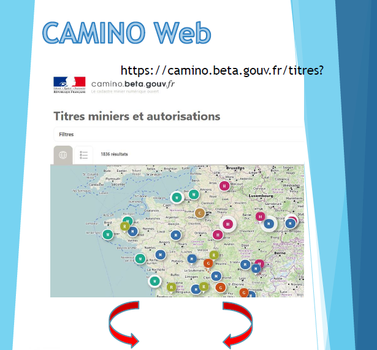
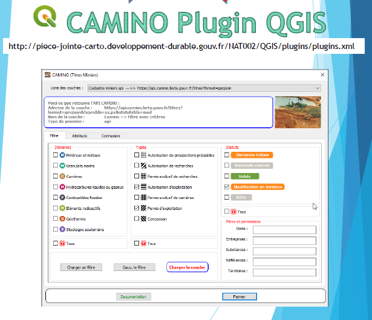
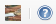

# PLUGIN Camino-flux-QGIS

> Plugin pour QGIS d'import des flux Geojson de [Camino](https://camino.beta.gouv.fr), le cadastre minier numérique ouvert

---           

## Technologies
- [Python 3.x]

---           

## Environnement
 - Version de QGIS 3.12.0-București ( fonctionne en 3.x )
 - Qt 5.11.2 
 - OS Version Windows 10 (10.0)

---

## Installation
### Via le dépôt MTES
Configurer les dépôts d'extension (menu 'Extension' >> 'Installer/Gérer les extensions' >> onglet 'Paramètres') avec l'url suivante [http://piece-jointe-carto.developpement-durable.gouv.fr/NAT002/QGIS/plugins/plugins.xml](http://piece-jointe-carto.developpement-durable.gouv.fr/NAT002/QGIS/plugins/plugins.xml)

Le plugin est accessible via le menu 'Extension' >> 'Installer/Gérer les extensions' >> onglet 'Tout' >> 'Rechercher' camino
Les mise à jour sont réalisées également dans ce menu.

### Manuellement
Décompresser le zip et installer le répertoire sous :
 - "C:\ProgramFiles\QGIS\profil\python\camino3" pour la version QGIS packagée MTES
 - "MonProfilAMoi\AppData\Roaming\QGIS\QGIS3\profiles\default\python\plugins\camino3" pour la version communautaire

---

### Flyers





---

## Structure des fichiers
```bash
.                        # `Racine où se trouve les sources .py`
│
├── doc                  # `documentation et flyer`
├── i18n                 # `fichiers des langues
└── icons                # `icones de l'application, menu, barre d'outils, IHM`
    └── metier           # `icones de la boite de dialogue de filtre`
└── requete              # `dossier par défaut de sauvegarde et de chargement des requetes (filtres)`
```
---
## Prise en main

### Accès au plugin

Le plugin est accessible via le menu 'Extension' >> 'CAMINO (Titres MIniers)' >> 'CAMINO (Titres MIniers)'


ou via la barre d'outils 



### Utilisation

Le plugin reprend le concept des filtres sur les titres de Camino et permet l'import et le chargement sous forme de couche dans QGIS des flux geojson.
img

Cliquer sur __Charger la couche__ pour importer les flux geojson et les charger dans une couche Vecteur QGIS.
Le plugin permet :
* d'utiliser les __filtres__ comme sur Camino,
* d'utiliser son compte Camino, depuis l'onglet __Connexion__, et ainsi disposer d'accès restreint à certains flux. A défaut le plugin fournit uniquement les flux dits publics. 

---

## Documentation
La documentation complète au format pdf est disponible dans le plugin et également [ici](https://github.com/MTES-MCT/camino-flux-QGIS/blob/master/doc/camino_doc.pdf)

---

## Crédits

### Production

- [La Fabrique Numérique, Ministère de la transition écologique et solidaire](https://www.ecologique-solidaire.gouv.fr/inauguration-fabrique-numerique-lincubateur-des-ministeres-charges-lecologie-et-des-territoires)

### Équipe

- Didier LECLERC, CMSIG développeur MTES/MCTRCT SG/SNUM/UNI/DRC
- Nicolas PETITOT, Développeur Camino, Appui métier pour Qgis

---

## Licence

Camino API, le cadastre minier numérique ouvert

[AGPL 3 ou plus récent](https://spdx.org/licenses/AGPL-3.0-or-later.html)
